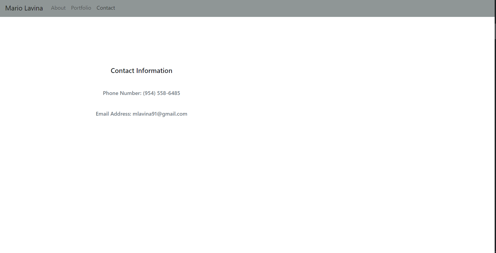

# React Portfolio 

## Table of Contents 

[Description](#description)

[Tech Used](#tech_used)

[Screenshots](#screenshots)

[Link to deployed app](#link)

[Questions](#questions)

## Description 

This project was to make a basic react template for my personal responsive portfolio. Included in the portfolio is the following:
an about me with a bio section and links to my social medias, a portfolio section that is where future projects and homeworks will be stored and a contact page (which right now is not functional, but will be soon) to allow future employers to reach me via email.. 

## Tech Used

* React
* React Bootstrap

## Screenshots

## Link 
[Link to deployed GitHub app](https://lavina91.github.io/react-portfolio/)